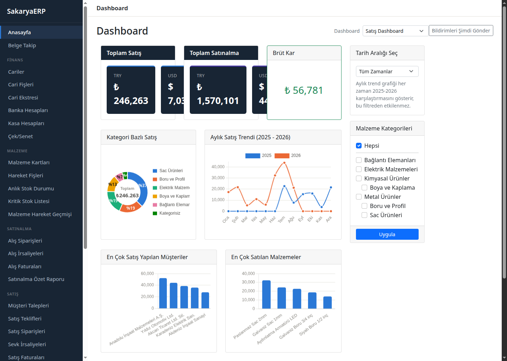
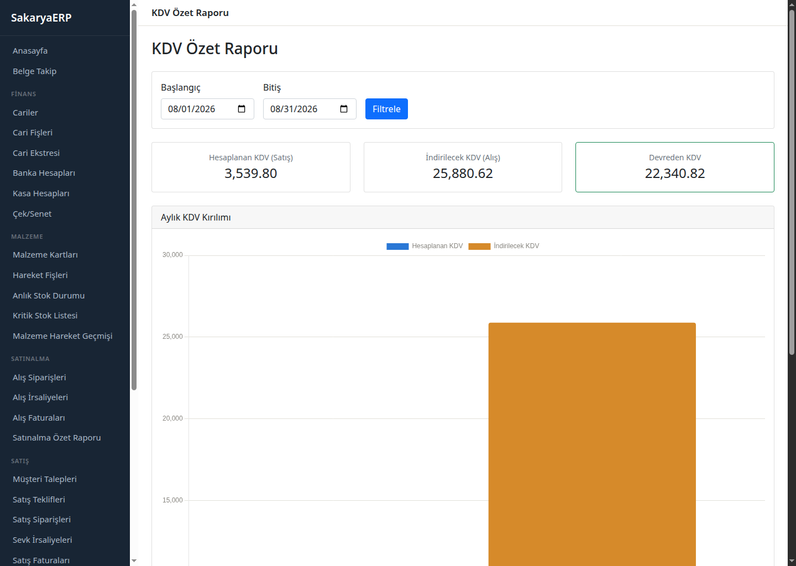
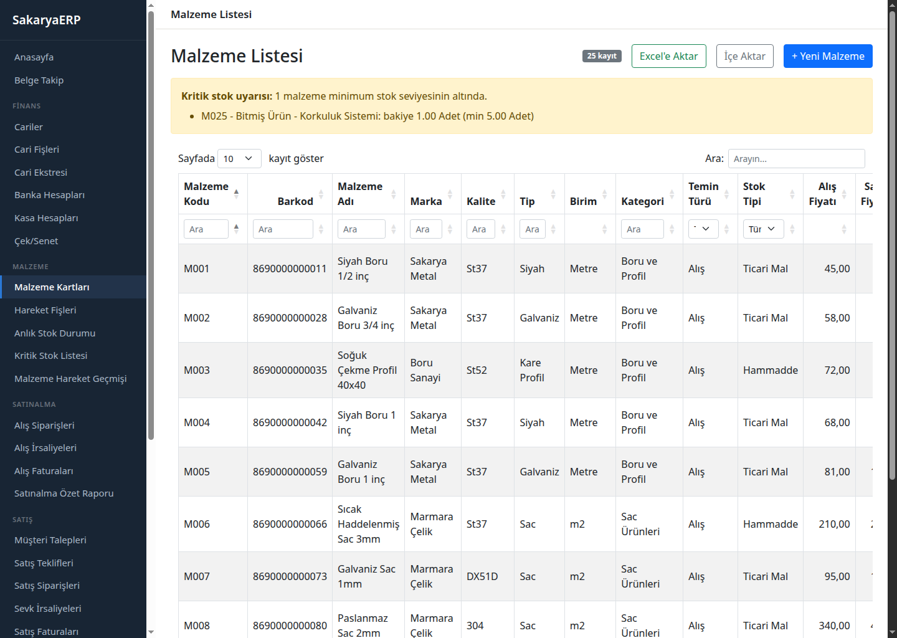
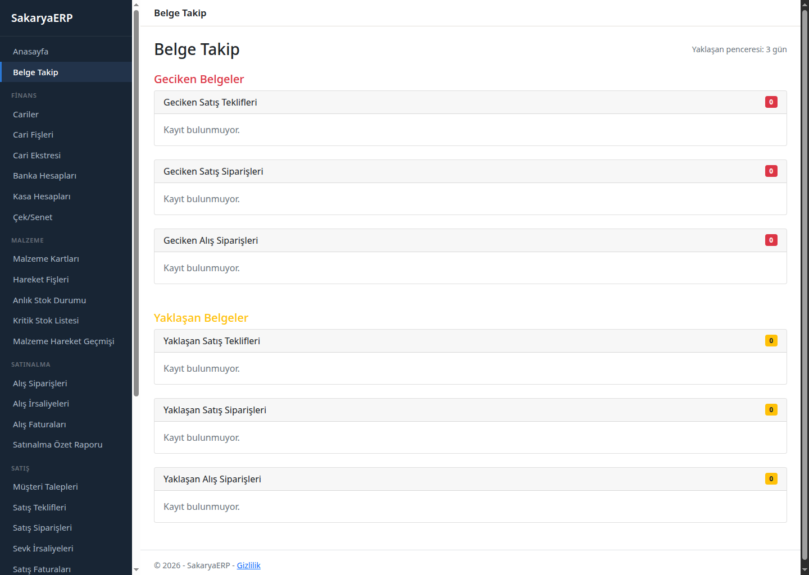
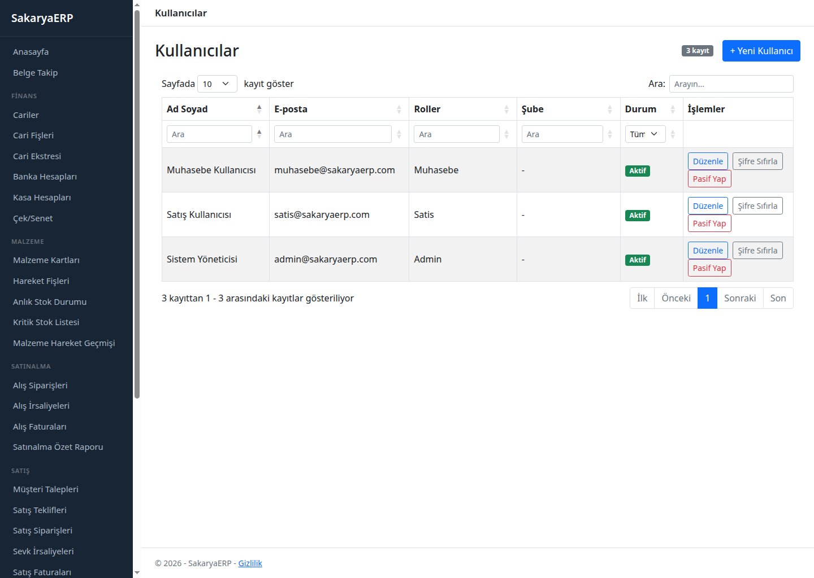
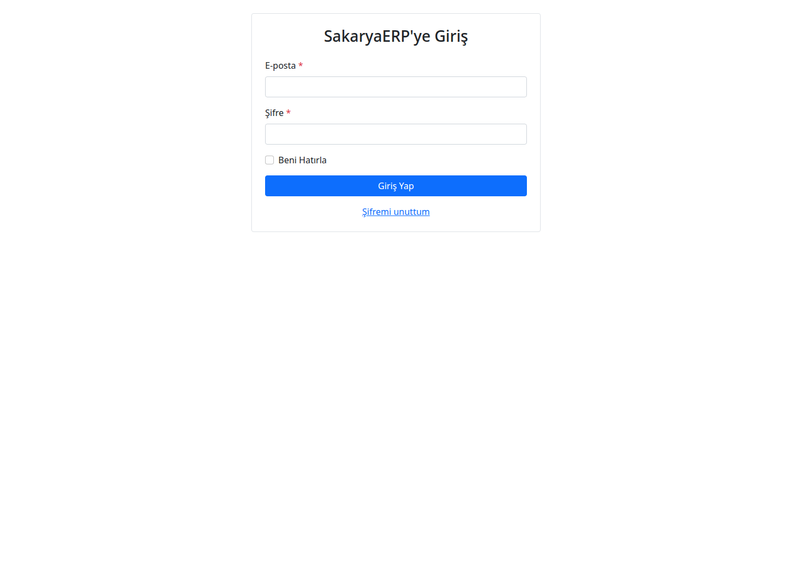

# TicariSistem


HarmonyERP'nin modül yapısına sadık, ticari döngünün uçtan uca (talep → teklif →
sipariş → irsaliye → fatura → muhasebe) çalıştığı bir mini ERP. 30 iş günlük bir
staj projesi kapsamında geliştirildi; gün gün ilerleme raporu [docs/staj-defteri.md](docs/staj-defteri.md)'de.

## Ekran Görüntüleri

| Dashboard | KDV Özet Raporu |
|---|---|
|  |  |

| Malzeme Listesi | Belge Takip |
|---|---|
|  |  |

| Kullanıcılar | Giriş |
|---|---|
|  |  |

## Özellikler

- **Finans:** Cariler, Banka/Kasa Hesapları, Cari Fişleri, Cari Ekstresi
- **Çek ve Senet:** Durum takibi (Portföyde / Tahsilde / Ciro / Karşılıksız / Tahsil Edildi)
- **Malzeme:** Malzeme Kartları, Hareket Fişleri, Anlık Stok / Kritik Stok / Hareket Geçmişi raporları (şube filtreli)
- **Satınalma:** Alış Siparişi → Alış İrsaliyesi → Alış Faturası zinciri
- **Satış:** Müşteri Talebi → Satış Teklifi → Satış Siparişi → Sevk İrsaliyesi → Satış Faturası zinciri
- **Muhasebe:** Basit Hesap Planı; fatura onaylandığında otomatik yevmiye kaydı (KDV ve satılan malın maliyeti/COGS dahil)
- **Raporlama:** Dashboard (satış/satınalma/brüt kar, kategori ve trend grafikleri), Satış/Satınalma özet raporları, KDV özet raporu, Belge Takip (geciken/yaklaşan teklif ve sipariş takibi)
- **Yönetim:** Rol bazlı yetkilendirme (Admin / Muhasebe / Satış), Admin'e özel kullanıcı yönetimi ekranı, kritik durumlar için e-posta bildirimi
- **Ortak:** PDF fatura/sipariş çıktısı (QuestPDF), Excel'e aktarım (ClosedXML), Docker ile deploy

Kapsamın gerekçeli tam listesi için [docs/gercek-erp-boslugu-analizi.md](docs/gercek-erp-boslugu-analizi.md).

### Kapsam Dışı Bırakılanlar

Üretim/MRP, ayrı bir modül olarak CRM (Satış akışına entegre edildi), Bordro,
Kalite Kontrol, E-Ticaret, Dış Ticaret ve gelişmiş muhasebe (tam yevmiye/büyük
defter raporları, resmi KDV beyannamesi) — 30 günlük sürede gerçekçi bir kapsam
tutmak için bilerek dışarıda bırakıldı.

## Teknolojiler

- ASP.NET Core 8 (MVC + Razor)
- Entity Framework Core (Code First, migration tabanlı) + PostgreSQL
- ASP.NET Core Identity (rol bazlı yetkilendirme)
- Bootstrap 5 + DataTables.js
- QuestPDF (PDF çıktısı), ClosedXML (Excel), Chart.js (grafikler)
- xUnit + EF Core InMemory provider (59 test)
- Docker Compose (web + db + nginx)

## Mimari

`Controller → Service → DbContext` katmanlı mimari, Repository/UnitOfWork
deseni üzerinden. Entity'ler View'lara doğrudan gönderilmez, her ekran için
ayrı ViewModel/DTO kullanılır. `BaseEntity` tüm tablolarda soft delete +
audit alanları (`CreatedAt`, `UpdatedAt`, `CreatedBy`) sağlar; değişiklik
geçmişi `AuditLog` tablosuna otomatik yazılır.

## Kurulum (Yerel Geliştirme)

Ön koşul: .NET 8 SDK, Docker.

```bash
git clone https://github.com/Furkan1785/Staj_Proje.git
cd Staj_Proje

# Veritabanını ayağa kaldır
docker compose up -d db

# Bağlantı bilgisini user-secrets ile tanımla
cd SakaryaERP
dotnet user-secrets set "ConnectionStrings:DefaultConnection" \
  "Host=localhost;Port=5432;Database=ticarisistem;Username=ticarisistem;Password=<db-sifresi>"

dotnet ef database update
dotnet watch run
```

Uygulama `http://localhost:5156` üzerinde açılır. Development ortamında
`DbSeeder` ilk açılışta temel Cari/Banka/Kasa/Şube kayıtlarını otomatik ekler.

### Zengin Demo Verisiyle Çalıştırma

```bash
dotnet run -- --seed-demo
```

Cariler, malzeme kartları ve onaylı satış/alış zincirleriyle dolu bir demo
veri seti yükler (tablo doluysa hiçbir şey yapmaz).

### Docker ile Tam Ortam

```bash
cp .env.example .env   # POSTGRES_PASSWORD'ü doldur
docker compose up -d --build
```

Sunucuya (Oracle Cloud Free Tier) deploy adımları için
[docs/deploy-oracle-cloud.md](docs/deploy-oracle-cloud.md).

## Canlı Demo

Henüz genel erişime açık bir demo adresi yok — deploy rehberi
[docs/deploy-oracle-cloud.md](docs/deploy-oracle-cloud.md)'de hazır, VPS'e
alınma adımı bekleniyor.

## Demo Hesapları

| Rol | E-posta | Şifre |
|---|---|---|
| Admin | admin@ticarisistem.com | Admin123! |
| Muhasebe | muhasebe@ticarisistem.com | Muhasebe123! |
| Satış | satis@ticarisistem.com | Satis123! |

## Testler

```bash
dotnet test SakaryaERP.sln
```

## Proje Yapısı

```
SakaryaERP/
  Controllers/    İnce controller'lar, iş mantığı Service katmanında
  Models/         Entity'ler
  ViewModels/     Ekrana özel DTO'lar
  Services/       İş mantığı (stok, cari bakiye, belge zinciri, muhasebe entegrasyonu)
  Data/           DbContext, Migrations, Seeder'lar
  Views/          Razor sayfaları
  Helpers/        Ortak hesaplama/yardımcı sınıflar (FinansHesaplama, ExcelYardimcisi)
SakaryaERP.Tests/ xUnit test projesi
docs/             Analiz/tasarım/deploy dokümanları
```
