# SakaryaERP — Varlık-İlişki Diyagramı

> **Not:** Diyagramda gösterilmeyen ama tüm entity'lerde ortak olan `BaseEntity` alanları:
> `Id (PK)`, `CreatedAt`, `UpdatedAt`, `CreatedBy`, `IsDeleted` (soft delete).

```mermaid
erDiagram

    %% ── ALTYAPI / KİMLİK ────────────────────────────────────────
    AppUser {
        string  Id          PK
        string  UserName
        string  Email
        string  AdSoyad
        int     SubeId      FK
    }

    AppRole {
        string Id      PK
        string Name
    }

    Sube {
        int    Id       PK
        string SubeAdi
        string Adres
    }

    %% ── FİNANS ──────────────────────────────────────────────────
    Cari {
        int     Id           PK
        string  CariKodu
        string  Unvan
        int     CariTipi     "enum: Musteri / Tedarikci / HerIkisi"
        string  VergiNo
        string  Adres
        string  Telefon
        string  EMail
        decimal Bakiye
        decimal KrediLimiti
    }

    BankaHesabi {
        int     Id          PK
        string  HesapAdi
        string  BankaAdi
        string  IBAN
        decimal Bakiye
        string  ParaBirimi
    }

    KasaHesabi {
        int     Id          PK
        string  KasaAdi
        decimal Bakiye
        string  ParaBirimi
    }

    CariFisi {
        int      Id              PK
        string   FisNo
        int      CariId          FK
        datetime Tarih
        int      FisTipi         "enum: Borc / Alacak / Mahsup"
        decimal  Tutar
        int      OdemeYontemi    "enum: Nakit / Havale / KrediKarti"
        int      BankaHesabiId   FK "nullable"
        int      KasaHesabiId    FK "nullable"
        string   Aciklama
    }

    CekSenet {
        int      Id          PK
        int      BelgeTipi   "enum: Cek / Senet"
        string   BelgeNo
        int      CariId      FK
        string   CiroBilgisi
        datetime VadeTarihi
        decimal  Tutar
        string   BankaAdi
        string   SubeAdi
        int      Durum       "enum: Portfolyde/Tahsilde/Ciro/Karsiliqsiz/TahsilEdildi"
    }

    %% ── MUHASEBE ─────────────────────────────────────────────────
    HesapPlani {
        int    Id          PK
        string HesapKodu
        string HesapAdi
        int    HesapTipi   "enum: Aktif / Pasif / Gelir / Gider / Ozkaynak"
        int    ParentId    FK "nullable — hiyerarşik"
    }

    MuhasebeFisi {
        int      Id              PK
        string   FisNo
        datetime Tarih
        int      SatisFaturasiId FK "nullable"
        int      AlisFaturasiId  FK "nullable"
    }

    MuhasebeFisiKalemi {
        int     Id             PK
        int     MuhasebeFisiId FK
        int     HesapPlaniId   FK
        decimal Borc
        decimal Alacak
        string  Aciklama
    }

    %% ── MALZEME / STOK ──────────────────────────────────────────
    MalzemeKategori {
        int    Id          PK
        string KategoriAdi
        int    ParentId    FK "nullable — hiyerarşik"
    }

    Malzeme {
        int     Id              PK
        string  MalzemeKodu
        string  Barkod
        string  MalzemeAdi
        string  Marka
        string  Kalite
        string  Tip
        string  Birim
        int     TeminTuru       "enum: Alis / Uretim / AlisUretim"
        int     StokTipi        "enum: TicariMal/Hammadde/YariMamul/Mamul"
        decimal AlisFiyati
        decimal SatisFiyati
        decimal KdvOrani
        decimal MinStokMiktari
        decimal MaxStokMiktari
        string  RafNo
        decimal Bakiye
        int     KategoriId      FK
    }

    MalzemeHareketFisi {
        int      Id           PK
        string   FisNo
        datetime Tarih
        int      HareketTipi  "enum: Giris / Cikis / Transfer / Fire"
        int      SubeId       FK
    }

    MalzemeHareketFisiKalemi {
        int     Id                    PK
        int     MalzemeHareketFisiId  FK
        int     MalzemeId             FK
        decimal Miktar
        string  Aciklama
    }

    %% ── SATINALMA AKIŞI ─────────────────────────────────────────
    AlisSiparisi {
        int      Id       PK
        int      CariId   FK
        int      SubeId   FK
        datetime Tarih
        int      Durum    "enum: Beklemede / Onaylandi / Iptal"
    }

    AlisSiparisiKalemi {
        int     Id              PK
        int     AlisSiparisiId  FK
        int     MalzemeId       FK
        decimal Miktar
        decimal BirimFiyat
        decimal KdvOrani
    }

    AlisIrsaliyesi {
        int      Id              PK
        int      AlisSiparisiId  FK "nullable"
        int      CariId          FK
        int      SubeId          FK
        datetime Tarih
    }

    AlisIrsaliyesiKalemi {
        int     Id               PK
        int     AlisIrsaliyesiId FK
        int     MalzemeId        FK
        decimal Miktar
    }

    AlisFaturasi {
        int      Id               PK
        int      CariId           FK
        int      AlisSiparisiId   FK "nullable"
        int      AlisIrsaliyesiId FK "nullable"
        datetime Tarih
        int      Durum
    }

    AlisFaturasiKalemi {
        int     Id             PK
        int     AlisFaturasiId FK
        int     MalzemeId      FK
        decimal Miktar
        decimal BirimFiyat
        decimal KdvOrani
    }

    %% ── SATIŞ AKIŞI ─────────────────────────────────────────────
    MusteriTalebi {
        int      Id       PK
        int      CariId   FK
        datetime Tarih
        string   TalepNo
        string   Icerik
        int      Durum
    }

    SatisTeklifi {
        int      Id              PK
        int      CariId          FK
        int      MusteriTalebiId FK "nullable"
        datetime Tarih
        int      Durum
    }

    SatisTeklifiKalemi {
        int     Id             PK
        int     SatisTeklifiId FK
        int     MalzemeId      FK
        decimal Miktar
        decimal BirimFiyat
        decimal KdvOrani
        decimal Iskonto
    }

    SatisSiparisi {
        int      Id             PK
        int      CariId         FK
        int      SatisTeklifiId FK "nullable"
        datetime Tarih
        int      Durum
    }

    SatisSiparisiKalemi {
        int     Id               PK
        int     SatisSiparisiId  FK
        int     MalzemeId        FK
        decimal Miktar
        decimal BirimFiyat
        decimal KdvOrani
        decimal Iskonto
    }

    SevkIrsaliyesi {
        int      Id               PK
        int      SatisSiparisiId  FK
        int      SubeId           FK
        datetime Tarih
        string   SevkAdresi
        string   AracSofor
    }

    SevkIrsaliyesiKalemi {
        int     Id               PK
        int     SevkIrsaliyesiId FK
        int     MalzemeId        FK
        decimal Miktar
    }

    SatisFaturasi {
        int      Id               PK
        int      CariId           FK
        int      SevkIrsaliyesiId FK "nullable"
        int      SatisSiparisiId  FK "nullable"
        datetime Tarih
        int      Durum
    }

    SatisFaturasiKalemi {
        int     Id              PK
        int     SatisFaturasiId FK
        int     MalzemeId       FK
        decimal Miktar
        decimal BirimFiyat
        decimal KdvOrani
        decimal Iskonto
    }

    %% ── İLİŞKİLER ───────────────────────────────────────────────

    %% Altyapı
    AppUser         ||--o{ Sube                 : "çalıştığı şube"
    Sube            ||--o{ MalzemeHareketFisi   : "şube hareketi"
    Sube            ||--o{ AlisSiparisi         : "şube siparişi"
    Sube            ||--o{ AlisIrsaliyesi       : "şube irsaliyesi"
    Sube            ||--o{ SevkIrsaliyesi       : "şube sevki"

    %% HesapPlani hiyerarşisi (öz-ilişki)
    HesapPlani      ||--o{ HesapPlani           : "alt hesaplar"

    %% MalzemeKategori hiyerarşisi (öz-ilişki)
    MalzemeKategori ||--o{ MalzemeKategori      : "alt kategoriler"
    MalzemeKategori ||--o{ Malzeme              : "malzemeleri"

    %% Cari merkezi
    Cari            ||--o{ CariFisi             : "fişleri"
    Cari            ||--o{ CekSenet             : "çek/senetleri"
    Cari            ||--o{ MusteriTalebi        : "talepleri"
    Cari            ||--o{ SatisTeklifi         : "teklifleri"
    Cari            ||--o{ SatisSiparisi        : "satış siparişleri"
    Cari            ||--o{ SatisFaturasi        : "satış faturaları"
    Cari            ||--o{ AlisSiparisi         : "alış siparişleri"
    Cari            ||--o{ AlisIrsaliyesi       : "alış irsaliyeleri"
    Cari            ||--o{ AlisFaturasi         : "alış faturaları"

    %% CariFisi ↔ Banka/Kasa
    BankaHesabi     ||--o{ CariFisi             : "ödeme hesabı"
    KasaHesabi      ||--o{ CariFisi             : "ödeme kasa"

    %% Satınalma akışı: Sipariş → İrsaliye → Fatura
    AlisSiparisi    ||--o{ AlisSiparisiKalemi   : "kalemleri"
    AlisSiparisi    ||--o{ AlisIrsaliyesi       : "irsaliyeleri"
    AlisIrsaliyesi  ||--o{ AlisIrsaliyesiKalemi : "kalemleri"
    AlisIrsaliyesi  ||--o{ AlisFaturasi         : "faturalanır"
    AlisSiparisi    ||--o{ AlisFaturasi         : "direkt faturalanır"
    AlisFaturasi    ||--o{ AlisFaturasiKalemi   : "kalemleri"

    %% Satış akışı: Talep → Teklif → Sipariş → Sevk → Fatura
    MusteriTalebi   ||--o{ SatisTeklifi         : "dönüşür"
    SatisTeklifi    ||--o{ SatisTeklifiKalemi   : "kalemleri"
    SatisTeklifi    ||--o{ SatisSiparisi        : "dönüşür"
    SatisSiparisi   ||--o{ SatisSiparisiKalemi  : "kalemleri"
    SatisSiparisi   ||--o{ SevkIrsaliyesi       : "sevkleri"
    SevkIrsaliyesi  ||--o{ SevkIrsaliyesiKalemi : "kalemleri"
    SevkIrsaliyesi  ||--o{ SatisFaturasi        : "faturalanır"
    SatisSiparisi   ||--o{ SatisFaturasi        : "direkt faturalanır"
    SatisFaturasi   ||--o{ SatisFaturasiKalemi  : "kalemleri"

    %% Malzeme stok hareketleri
    Malzeme         ||--o{ MalzemeHareketFisiKalemi  : "hareketleri"
    MalzemeHareketFisi ||--o{ MalzemeHareketFisiKalemi : "kalemleri"

    %% Malzeme — tüm kalem tabloları
    Malzeme         ||--o{ AlisSiparisiKalemi   : ""
    Malzeme         ||--o{ AlisIrsaliyesiKalemi : ""
    Malzeme         ||--o{ AlisFaturasiKalemi   : ""
    Malzeme         ||--o{ SatisTeklifiKalemi   : ""
    Malzeme         ||--o{ SatisSiparisiKalemi  : ""
    Malzeme         ||--o{ SevkIrsaliyesiKalemi : ""
    Malzeme         ||--o{ SatisFaturasiKalemi  : ""

    %% Muhasebe otomatik yevmiye
    SatisFaturasi   ||--o| MuhasebeFisi         : "yevmiye kaydı"
    AlisFaturasi    ||--o| MuhasebeFisi         : "yevmiye kaydı"
    MuhasebeFisi    ||--o{ MuhasebeFisiKalemi   : "kalemleri"
    HesapPlani      ||--o{ MuhasebeFisiKalemi   : ""
```

## Modüller Arası Kritik Bağlantılar

| Tetikleyen Olay | Otomatik Sonuç |
|---|---|
| AlisIrsaliyesi onaylandı | Malzeme.Bakiye artar (stok girişi) |
| AlisFaturasi onaylandı | Cari.Bakiye artar (borç), MuhasebeFisi oluşur |
| SevkIrsaliyesi onaylandı | Malzeme.Bakiye düşer (stok çıkışı, negatif stok kontrolü) |
| SatisFaturasi onaylandı | Cari.Bakiye düşer (alacak), MuhasebeFisi oluşur |
| CekSenet → TahsilEdildi | CariFisi otomatik oluşur |
| CariFisi kaydedildi | Cari.Bakiye + seçili Banka/Kasa bakiyesi güncellenir |

## Cascade Delete Kuralları

- Ana belge silindiğinde ilgili `…Kalemi` tabloları cascade delete ile silinir.
- `Cari`, `Malzeme`, `HesapPlani` gibi master kayıtlar soft delete (`IsDeleted = true`) ile pasif yapılır, fiziksel olarak silinmez.
- `MuhasebeFisi` hiçbir zaman silinemez (muhasebe bütünlüğü).
