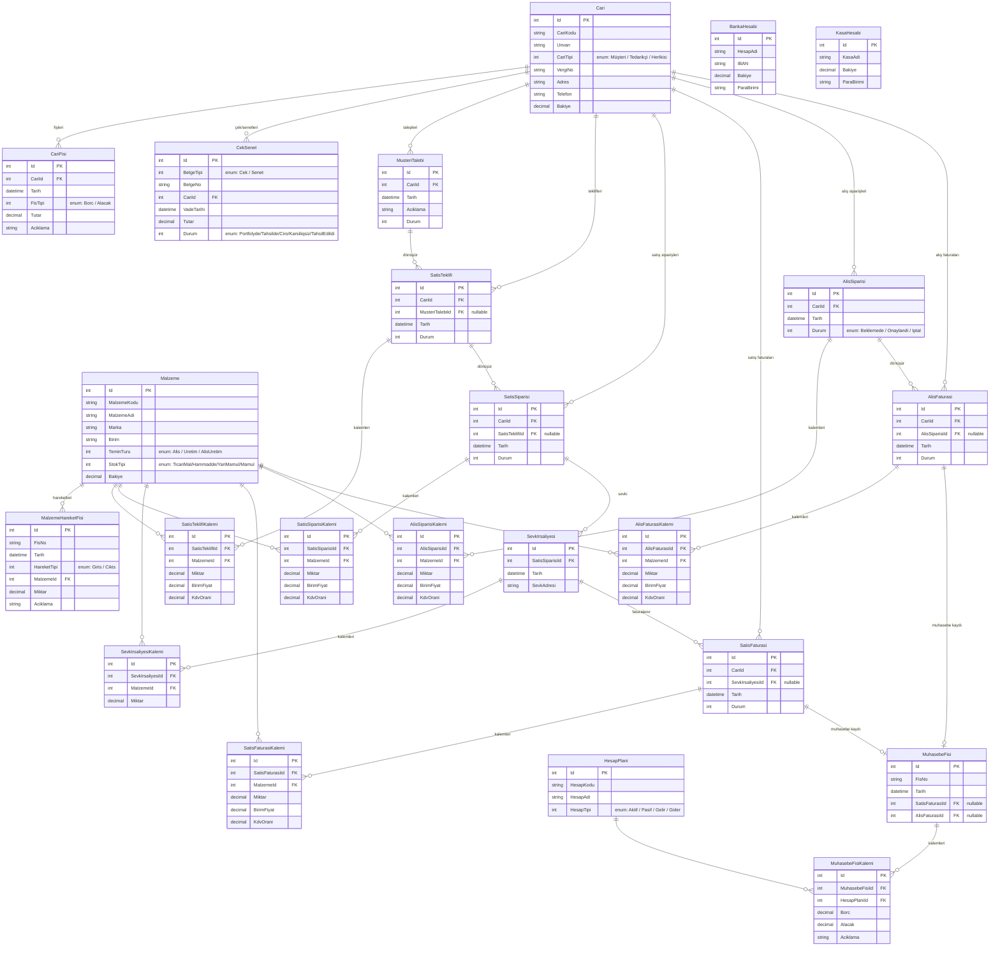

# SakaryaERP — Varlık-İlişki Diyagramı

## Notlar

- `CariTipi` = Müşteri | Tedarikçi | HerIkisi — Tedarikçiler AlisSiparisi akışında, Müşteriler Satış akışında kullanılır.
- Tüm kalem tabloları (…Kalemi) ana belgeye bağlı alt satırlardır; ana belge silindiğinde cascade delete ile silinir.
- `MuhasebeFisi.SatisFaturasiId` ve `AlisFaturasiId` nullable'dır; bir fiş ya satış ya da alış faturasından üretilir.
- `SatisTeklifi.MusteriTalebiId` nullable'dır; talep olmadan da direkt teklif oluşturulabilir.
- Stok bakiyesi (`Malzeme.Bakiye`) yalnızca `MalzemeHareketFisi` onayında, alış faturası onayında ve satış faturası onayında güncellenir — doğrudan elle değiştirilmez.
